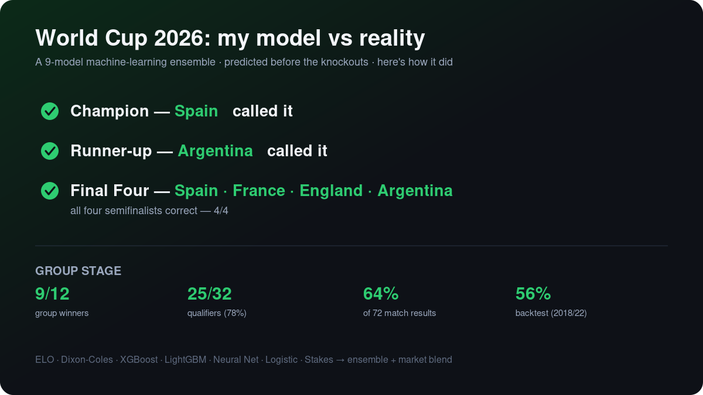

# 🏆 World Cup 2026 — Final Results: Model vs Reality

The tournament is over. Here is how the model's predictions held up against what actually happened.

## Knockout stage — the headline calls

| Prediction | Model said | Actually happened | Result |
|------------|-----------|-------------------|:------:|
| **Champion** | Spain | **Spain** (1–0 Argentina, a.e.t.) | ✅ |
| **Runner-up** | Argentina | **Argentina** | ✅ |
| **Both finalists** | Spain & Argentina | Spain & Argentina | ✅ |
| **Semi-finalists (final four)** | Spain · France · England · Argentina | Spain · France · England · Argentina | ✅ **4/4** |
| Semi-final 1 | Spain beat France | France 0–2 Spain | ✅ |
| Semi-final 2 | Argentina beat England | England 1–2 Argentina | ✅ |
| Third place | France | England (beat France 6–4) | ❌ |

The model correctly predicted the **champion, the runner-up, both finalists, and all four semifinalists** — its only knockout-podium miss was which of the two losing semifinalists took third.

## Group stage

| Metric | Result |
|--------|--------|
| Group winners | **9 / 12** correct |
| Qualifiers (of 32) | **25 / 32** (~78%) |
| Match results (all 72) | **64%** correct (Brier 0.184) |
| Backtest (WC 2018 + 2022) | 56% — at betting-market level |

## What made it work — and where it fell short

- **Strength:** at the sharp end of the tournament, where quality tends to win out, the model was excellent — it read the four best teams and the eventual winner correctly.
- **Weakness:** its misses were all in the chaos of the group stage and among mid-tier sides — it over-trusted established names (Uruguay, South Korea, Scotland, Türkiye all went home) and can't see injuries, momentum, or home advantage.
- **Lesson:** the biggest accuracy gains came from fixing *methodology* (a backtest bug, reading results from summed probabilities, rebalancing the ensemble) — not from more models. A single logistic regression matched the full 9-model ensemble.

*Predictions were locked in before the knockout stage; every claim above is verifiable against the official results.*
